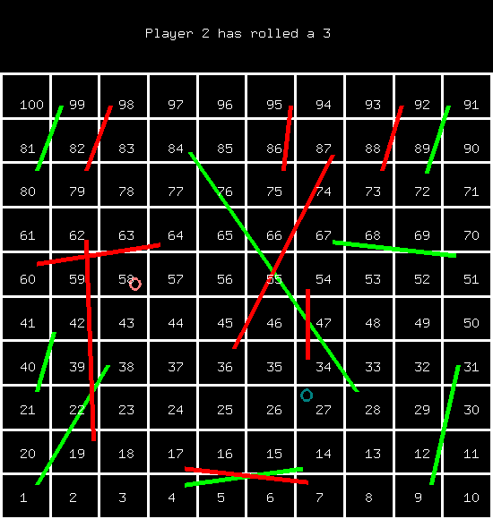

## Snake and Ladder OpenGL

The simplest OpenGL snake and ladder game developed as a part of Computer Graphics course in Semester 7.

The game features Snakes and Ladders as red and green lines respectively. This is designed as a two player game, with players starting outside the board and starts by rolling the dice. Animations of players moving across the tiles are included, as well as simple sound effects for movement, climbing ladder, snake swallowing, and victory song are added. This project is very useful for people who are starting to learn OpenGL.

#### Installation for Ubuntu
- Perform the installation of OpenGL, freeGlut, etc as per the instructions [here](http://www.cse.iitm.ac.in/~vplab/courses/CG/opengl_start.html).
- Install canberra-gtk-play. Or uncomment the system calls to play sound.
- Run the compile.sh script.

#### Running the game
- Compile the game by running the compile.sh script.
- Run the game by executing the snake-and-ladder.out

#### Basic logic of the game

- The snl_main.cpp contains the main GLUT loops and main functions. This also defines the game state variables like the \
player position, the dice value, turn flag and the rolling flag.
- The snl_game.cpp contains the various functions for drawing the various elements of the board like the grid, numbers, the player token, snakes and ladders.
- Rolling of the dice is simulated by generating a random number.
- The player positions are updated one by one to bring the effect of player moving by one position at a time.
- The main challenge in drawing the various elements of the board are that the positions move from left to right in odd rows and from right to left in even rows. This is handled in code by finding the appropriate rows.
- The snake and ladders have been implemented using an array with the index as their position and their values as their landing places. This eliminates iterating over 100 columns to check if the player has landed on either a snake or a ladder.
- Various conditions like when the current position and the rolled position exceeds 100 are handled.
- The game ends when the victory condition (Any of the player position has reached 100th position.) is satisified.
- The rolling flag is used so that no input is registered when a player is moving.

#### References
- [OpenGL Snake Game](https://www.youtube.com/watch?v=6Miai_t_ksw&list=PLWzp0Bbyy_3gXc0YBxiIR9Tb5KfmLSL_C) Cool tutorial, do check it out.
- [Drawing Text](https://www.youtube.com/watch?v=elE__Nouv54)
- [Drawing Circles](https://stackoverflow.com/questions/22444450/drawing-circle-with-opengl)
